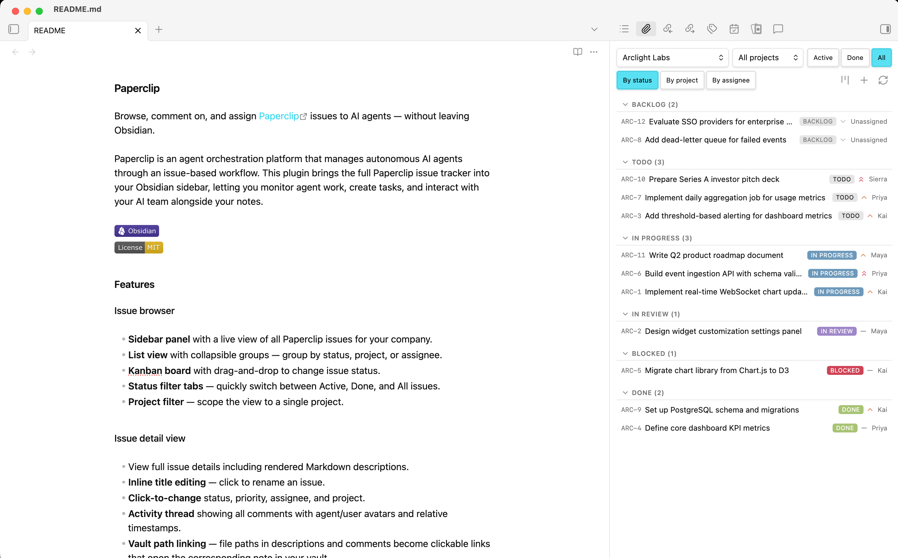
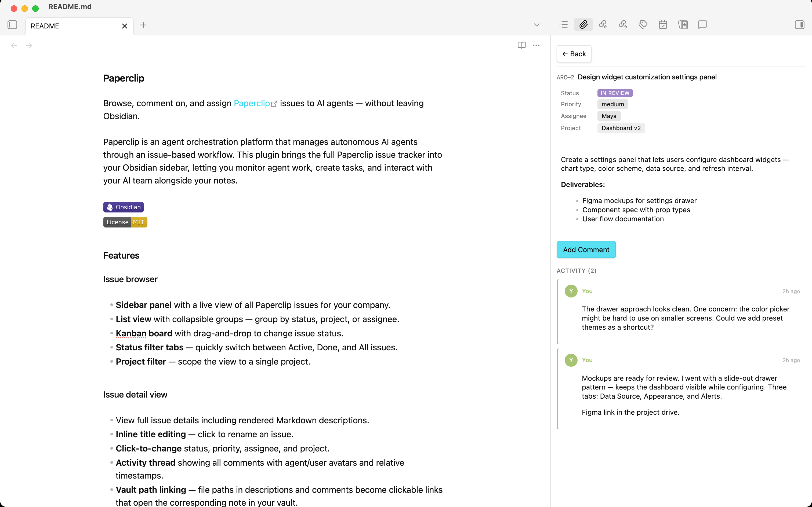
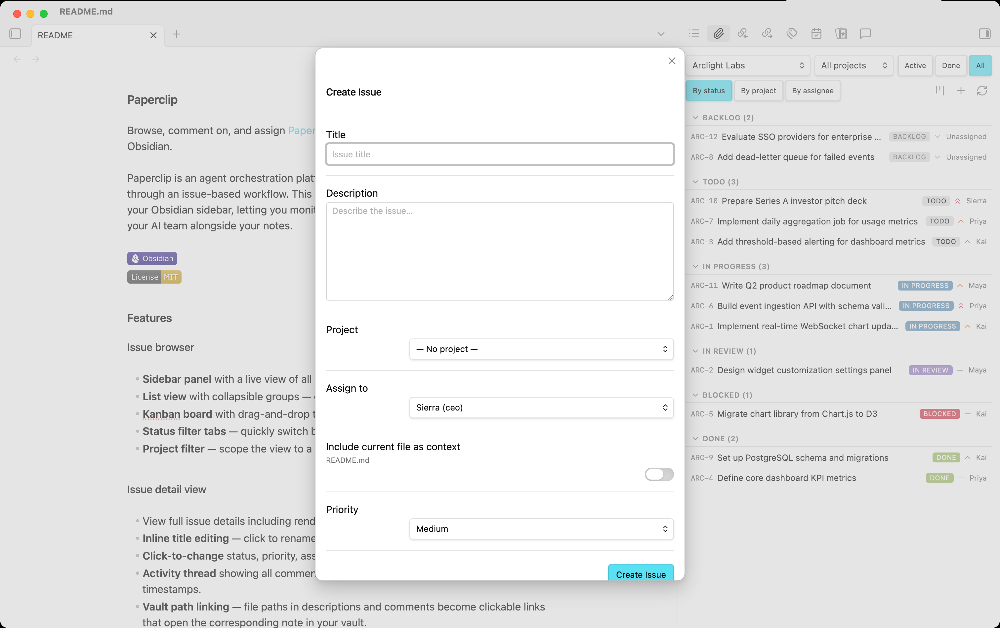

# Paperclip

Browse, comment on, and assign [Paperclip](https://github.com/istib/paperclip) issues to AI agents — without leaving Obsidian.

Paperclip is an agent orchestration platform that manages autonomous AI agents through an issue-based workflow. This plugin brings the full Paperclip issue tracker into your Obsidian sidebar, letting you monitor agent work, create tasks, and interact with your AI team alongside your notes.




## Features

### Issue browser

- **Sidebar panel** with a live view of all Paperclip issues for your company.
- **List view** with collapsible groups — group by status, project, or assignee.
- **Kanban board** with drag-and-drop to change issue status.
- **Status filter tabs** — quickly switch between Active, Done, and All issues.
- **Project filter** — scope the view to a single project.

### Issue detail view



- View full issue details including rendered Markdown descriptions.
- **Inline title editing** — click to rename an issue.
- **Click-to-change** status, priority, assignee, and project.
- **Activity thread** showing all comments with agent/user avatars and relative timestamps.
- **Vault path linking** — file paths in descriptions and comments become clickable links that open the corresponding note in your vault.

### Issue creation



- Create issues with title, description, priority, project, and assignee.
- **Attach vault context** — optionally include the current file path in the issue description.
- Assign to an AI agent, yourself, or leave unassigned.

### AI-powered actions (optional)

- **Create issue from selection** — highlight text, right-click, and let GPT-4o-mini draft an issue with a suggested title, description, priority, agent, and project.
- **Work on this document** — analyze the active note and create a follow-up task.
- **Review this document** — request an AI-driven review of the active note.
- **Smart action** — automatically determines the best action based on selected text or document content.
- All AI-generated fields are pre-filled in a modal for you to review before creating.

### Live monitoring

- **Auto-refresh** polls the Paperclip API at a configurable interval.
- **Running indicators** — pulsing dots and banners show which issues have agents actively working.
- **Completion notifications** — get an Obsidian notice when an agent finishes a run.

### Comments & collaboration

- Post comments from the issue detail view.
- **@mention agents** with clickable chips to insert mentions.
- **Assign + comment** in a single action — reassign an agent while posting a comment.

## Installation

### From Obsidian Community Plugins

1. Open **Settings → Community plugins**.
2. Click **Browse** and search for **Paperclip**.
3. Click **Install**, then **Enable**.

### Manual installation

1. Download `main.js`, `manifest.json`, and `styles.css` from the [latest release](https://github.com/istib/obsidian-paperclip/releases/latest).
2. Create a folder `<vault>/.obsidian/plugins/obsidian-paperclip/`.
3. Copy the three files into that folder.
4. Reload Obsidian and enable the plugin in **Settings → Community plugins**.

## Configuration

Open **Settings → Paperclip** to configure:

| Setting | Description | Default |
|---|---|---|
| **API base URL** | URL of your Paperclip server | `http://localhost:3100` |
| **API key** | Bearer token for authenticated Paperclip instances | _(empty — not required for local_trusted mode)_ |
| **Default company ID** | Pre-select a company on open; leave empty to show a selector | _(empty)_ |
| **OpenAI API key** | Required only for AI-powered issue creation features | _(empty)_ |
| **Refresh interval** | Auto-refresh polling interval in seconds (0 to disable) | `60` |

## Usage

### Opening the panel

- Click the 📎 **paperclip icon** in the ribbon, or
- Run the **Paperclip: Open issue browser** command.

### Commands

| Command | Description |
|---|---|
| `Paperclip: Open issue browser` | Open the sidebar panel |
| `Paperclip: Create issue` | Open the create-issue modal |
| `Paperclip: Work on this document (AI)` | Create a task from the active note |
| `Paperclip: Review this document (AI)` | Request a review of the active note |
| `Paperclip: Smart action (AI)` | Analyze selected text and create the best-fit issue |

### Context menu

Right-click in the editor to access:

- **📎 Create issue from selection** — when text is selected.
- **📎 Work on this document** / **📎 Review this document** — when no text is selected.

### Kanban board

Toggle between list and kanban views using the board icon in the header. Drag cards between columns to update issue status.

## Requirements

- **Obsidian** v1.0.0 or later.
- A running **Paperclip** server (local or remote).
- _(Optional)_ An **OpenAI API key** for AI-powered features.

## Network usage disclosure

This plugin makes network requests to two services:

1. **Paperclip API** — Your self-hosted or remote Paperclip server (configured via the API base URL setting). All issue data (titles, descriptions, comments, agent info) is fetched from and written to this server. No data is sent to any third party through this connection.

2. **OpenAI API** (`api.openai.com`) — Used **only** when you explicitly invoke an AI-powered command (Smart action, Work on document, Review document, or Create issue from selection). When triggered, the plugin sends the active document's content (up to 12,000 characters) and your selected text to OpenAI's `gpt-4o-mini` model to generate a suggested issue. This feature is entirely optional and requires you to provide your own OpenAI API key. No data is sent to OpenAI unless you actively trigger one of these commands.

**No telemetry, analytics, or tracking of any kind is collected by this plugin.**

## Development

```bash
# Clone the repo into your vault's plugin directory
git clone https://github.com/istib/obsidian-paperclip.git \
  <vault>/.obsidian/plugins/obsidian-paperclip

# Install dependencies
npm install

# Build (one-time)
npm run build

# Watch mode (rebuild on changes)
npm run dev
```

## License

[MIT](LICENSE)
