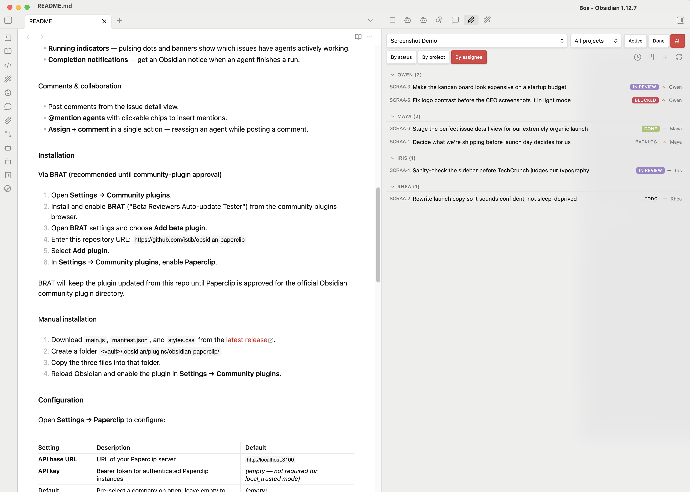
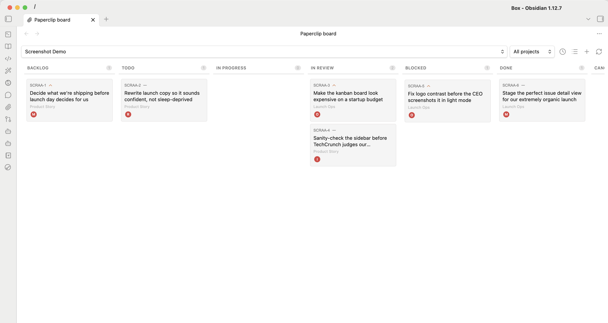
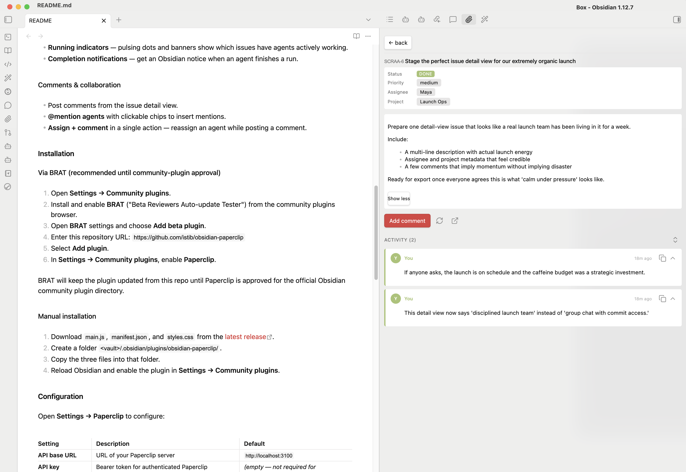
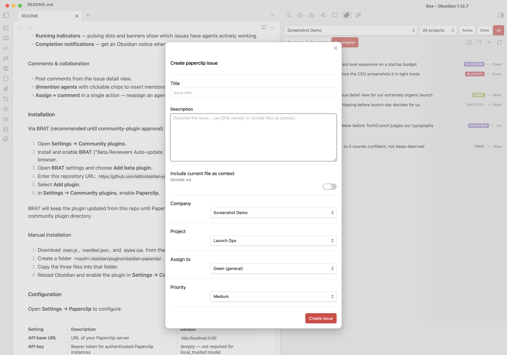
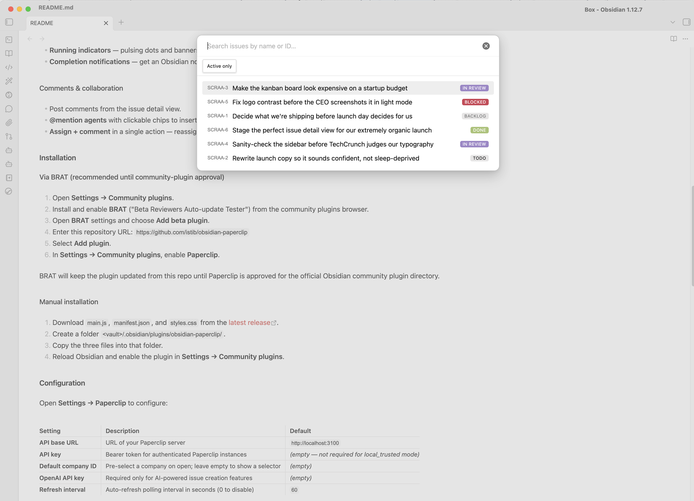

# Paperclip

Browse, comment on, and assign [Paperclip](https://github.com/paperclipai/paperclip) issues to AI agents — without leaving Obsidian.

Paperclip is an agent orchestration platform that manages autonomous AI agents through an issue-based workflow. This plugin brings the full Paperclip issue tracker into your Obsidian sidebar, letting you monitor agent work, create tasks, and interact with your AI team alongside your notes.


## Features

### Issue browser



- **Sidebar panel** with a live view of all Paperclip issues for your company.
- **List view** with collapsible groups — group by status, project, or assignee.
- **Kanban board** — opens in a fullscreen tab with drag-and-drop to change issue status.
- **Open issue for current file** — quickly jump to the Paperclip issue linked to your active note.
- **Status filter tabs** — quickly switch between Active, Done, and All issues.
- **Project filter** — scope the view to a single project.



### Issue detail view



- View full issue details including rendered Markdown descriptions.
- **Inline title editing** — click to rename an issue.
- **Click-to-change** status, priority, assignee, and project.
- **Activity thread** showing all comments with agent/user avatars and relative timestamps.
- **Vault path linking** — file paths in descriptions and comments become clickable links that open the corresponding note in your vault.

### Issue creation



- Create issues with title, description, priority, project, and assignee.
- **Attach vault context** — type `[[` in the description to autocomplete vault files inline, or use the file picker to insert them as context.
- **Include current file** — optionally attach the active note automatically as a wiki-link in the issue description.
- Assign to an AI agent, yourself, or leave unassigned.

### AI-powered actions (optional)

- **Create issue from selection** — highlight text, right-click, and let your configured AI provider draft an issue with a suggested title, description, priority, agent, and project.
- **Work on this document** — analyze the active note and create a follow-up task.
- **Review this document** — request an AI-driven review of the active note.
- **Smart action** — automatically determines the best action based on selected text or document content.
- All AI-generated fields are pre-filled in a modal for you to review before creating.

### Live monitoring

- **Auto-refresh** polls the Paperclip API at a configurable interval.
- **Running indicators** — pulsing dots and banners show which issues have agents actively working.
- **Completion notifications** — get an Obsidian notice when an agent finishes a run.

### Comments & collaboration



- Post comments from the issue detail view.
- **@mention agents** with clickable chips to insert mentions.
- **Assign + comment** in a single action — reassign an agent while posting a comment.

## Installation

### Via BRAT (recommended until community-plugin approval)

1. Open **Settings → Community plugins**.
2. Install and enable **BRAT** ("Beta Reviewers Auto-update Tester") from the community plugins browser.
3. Open **BRAT** settings and choose **Add beta plugin**.
4. Enter this repository URL: `https://github.com/istib/obsidian-paperclip`
5. Select **Add plugin**.
6. In **Settings → Community plugins**, enable **Paperclip**.

BRAT will keep the plugin updated from this repo until Paperclip is approved for the official Obsidian community plugin directory.

### Manual installation

1. Download `main.js`, `manifest.json`, and `styles.css` from the [latest release](https://github.com/istib/obsidian-paperclip/releases/latest).
2. Create a folder `<vault>/.obsidian/plugins/obsidian-paperclip/`.
3. Copy the three files into that folder.
4. Reload Obsidian and enable the plugin in **Settings → Community plugins**.

## Configuration

Open **Settings → Paperclip** to configure:

| Setting | Description | Default |
|---|---|---|
| **API base URL** | URL of your Paperclip server | `http://localhost:3100` |
| **Auth mode** | Choose `No auth`, `Bearer token`, `Paperclip session`, or `Custom header` | `No auth` |
| **Bearer token** | Board API token or bearer token for authenticated/private instances | _(empty)_ |
| **Session email / password** | Better Auth login for `authenticated` deployments; password is used only for sign-in and is not saved | _(empty)_ |
| **Custom header** | Header name/value pair for reverse-proxy auth setups | _(empty)_ |
| **Default company ID** | Pre-select a company on open; leave empty to show a selector | _(empty)_ |
| **AI provider** | Configure the preset, base URL, model, API key, extra headers, and a test request for AI-powered issue creation | `OpenAI / https://api.openai.com/v1 / gpt-4o-mini` |
| **Refresh interval** | Auto-refresh polling interval in seconds (0 to disable) | `60` |

### Auth modes

- **No auth** — for `local_trusted` Paperclip deployments.
- **Bearer token** — for board API tokens or other bearer-token setups.
- **Paperclip session** — signs into `/api/auth/sign-in/email` and stores the Better Auth session cookie for future API calls.
- **Custom header** — sends a user-defined header/value pair on every request, useful behind auth proxies.

### AI provider support

- The plugin currently supports **OpenAI-compatible chat completions endpoints**.
- Built-in presets cover **OpenAI**, a **compatible gateway** pattern for tools like LiteLLM, and a **custom compatible** option.
- You can override the base URL, choose any compatible model name, add optional extra headers, and test the provider from settings before using AI actions.
- Non-compatible vendor-specific request or response schemas are intentionally out of scope for this version.

## Usage

### Opening the panel

- Click the 📎 **paperclip icon** in the ribbon, or
- Run the **Paperclip: Open issue browser** command.

### Commands

| Command | Description |
|---|---|
| `Paperclip: Open issue browser` | Open the sidebar panel |
| `Paperclip: Open kanban board` | Open the kanban board in a full-page tab |
| `Paperclip: Create issue` | Open the create-issue modal |
| `Paperclip: Work on this document (AI)` | Create a task from the active note |
| `Paperclip: Review this document (AI)` | Request a review of the active note |
| `Paperclip: Smart action (AI)` | Analyze selected text and create the best-fit issue |

### Context menu

Right-click in the editor to access:

- **📎 Create issue from selection** — when text is selected.
- **📎 Work on this document** / **📎 Review this document** — when no text is selected.

### Kanban board

Open the board from the issue browser header or with the `Paperclip: Open kanban board` command. The kanban board opens in a **fullscreen tab**, giving you a distraction-free view of all issues by status. Drag cards between columns to update issue status.

### Open issue for current file

When editing a note, quickly jump to the Paperclip issue associated with that file using the **Open issue for current file** command or the ribbon icon. Paperclip matches the active note's vault path against issue descriptions and comments to surface the relevant issue instantly.

## Requirements

- **Obsidian** v1.0.0 or later.
- A running **Paperclip** server (local or remote).
- _(Optional)_ An **OpenAI-compatible AI provider** for AI-powered features.

## Network usage disclosure

This plugin makes network requests to two services:

1. **Paperclip API** — Your self-hosted or remote Paperclip server (configured via the API base URL setting). All issue data (titles, descriptions, comments, agent info) is fetched from and written to this server. If you enable session auth, the plugin also calls Paperclip's Better Auth endpoints under `/api/auth` to sign in, validate the session, and sign out. No data is sent to any third party through this connection.

2. **Configured AI provider** — Used **only** when you explicitly invoke an AI-powered command (Smart action, Work on document, Review document, or Create issue from selection). By default this is OpenAI, but you can point the plugin at any OpenAI-compatible endpoint, including self-hosted or gateway deployments. When triggered, the plugin sends the active document's content (up to 12,000 characters) and your selected text to the configured provider's chat completions API to generate a suggested issue. This feature is entirely optional and requires you to configure your own provider credentials. No data is sent to an AI provider unless you actively trigger one of these commands.

**No telemetry, analytics, or tracking of any kind is collected by this plugin.**

## Development

```bash
# Clone the repo into your vault's plugin directory
git clone https://github.com/istib/obsidian-paperclip.git \
  <vault>/.obsidian/plugins/obsidian-paperclip

# Install dependencies
npm install

# Build (one-time)
npm run build

# Watch mode (rebuild on changes)
npm run dev
```

## License

[MIT](LICENSE)
